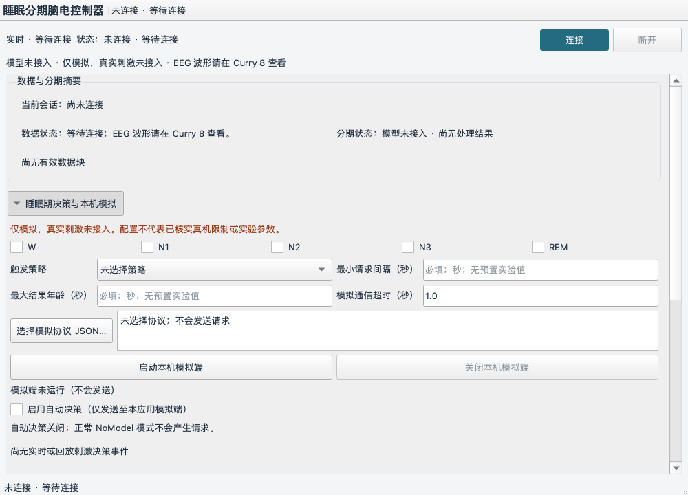

# 睡眠分期电刺激控制器

P-GUI 已移除实时和回放波形，EEG 请在 Curry 8 查看。控制台保留完整 EEG 接收、校验、可选 ONNX 睡眠分期、保存和逐块只读回放。Windows 锁定安装、原生 GUI、中文/空格路径权限和 TCP/UDP 合成回环已验证通过；真实 Curry/Rally 设备仍未联调。

当前已完成 P1/P2 桌面、Curry 脑电接入、可选会话记录和只读离线回放，并实现 P3 睡眠期策略、协议适配及受控本机 UDP 模拟联调。ONNX 适配器和随包 LiteSleepNet EDF20 FP32 模型作为可选能力保留，但正式默认是 `NoModel`：启动、连接和采集不会自动检查或加载模型，缺失模型文件也不阻止采集、保存或回放。只有用户连接前显式勾选 ONNX 启用后才校验并运行模型；错误不会静默回退。真实电刺激、真实 Rally 设备及跨设备时钟同步仍未接入。

## 开发环境

Windows 可双击根目录 `setup_windows.cmd` 自动配置环境，或运行 `powershell.exe -NoProfile -ExecutionPolicy Bypass -File .\scripts\setup_windows.ps1`。详见 [Windows 配置说明](docs/WINDOWS_SETUP.md)。

在本目录运行：

```sh
uv sync --locked
.venv\Scripts\Activate.ps1
```

Python 使用 3.11，依赖和开发工具由 `pyproject.toml` 声明，具体版本由 `uv.lock` 固定。正式部署目标为 Windows，推理使用 ONNX Runtime CPU provider。日常同步使用 `--locked`，有意修改依赖时再更新锁文件。

Curry 以本地可编辑依赖安装，当前适配源码随项目保存在 `curry8-netstream/`。从 GitHub 克隆本项目后，在仓库根目录执行 `uv sync --locked` 即可，无需再次克隆 Curry 或应用补丁。`patches/` 保留适配来源说明，当前源码已包含这些改动。

## 目录职责

```text
sleep/
  AGENTS.md                    主线程与执行线程规则
  README.md                    项目入口
  pyproject.toml               包配置、依赖、测试发现配置
  uv.lock                      依赖锁文件
  .python-version              Python 版本选择
  .gitignore                   本地环境、原件和运行产物排除项
  src/sleep_stim_controller/    控制器、分期流水线、v1 会话读写/回放、P3 策略/本机模拟与 GUI
  curry8-netstream/             随项目发布的 Curry 通信本地依赖
  docs/                        需求与后续接口合同
  decision_records/            当前队列、决策及计划
  reports/                     阅读、验收与执行证据
  reference/                   原始参考材料及来源索引
  .venv/                       uv 管理的本地环境
```

根级 `tests/` 包含控制器、分期/会话格式、离屏 UI 和本机回环合成 Curry 服务测试；`curry8-netstream/` 保存 Curry 依赖源码和测试，不将参考 Demo 当作产品代码。

## 当前可用验证入口

```sh
uv run --locked python -c 'import sleep_stim_controller, curry_netstream, PySide6'
uv run --locked pytest
```

启动桌面程序：

```sh
uv run --locked sleep-stim-controller
```

窗口默认使用 `127.0.0.1:4455`，连接期间地址和端口不可修改。默认窗口 1000×720，最小 800×600；顶部固定连接、模式和错误区域，主体依次展示数据/分期摘要、模型配置、刺激配置、会话记录/回放。模型勾选框默认关闭，此时走 `NoModel`，不校验默认路径；需要使用 ONNX 时，须在连接前显式启用，再选择 ONNX 文件并填写一个与 Curry 握手标签精确匹配的通道名，握手完成后界面显示可用通道。摘要显示实际会话、块和样本区间、通道、采样率；长错误、方案和路径可滚动阅读与复制。

显式启用 ONNX 后，模型输入固定解释为 µV，并连续应用 50 Hz 工频处理和 0.3–35 Hz 带通，再重采样到 100 Hz；不做逐样本 z-score 或其他静默幅值归一化。模型时间维度从 ONNX 输入自动读取，必须是 3000 的正整数倍：3000 点为当前 30 秒，6000 点为前一段加当前段，9000 点依此类推；每个连续段开头缺少历史时复制本段最早可用 epoch。100 Hz 数据的 50 Hz 位于 Nyquist 点，无法单独设计数字陷波，此时由 35 Hz 低通边界排除；源采样率高于 100 Hz 时显式应用 50 Hz notch。实际选通配置、模型 SHA-256、准备成功后读取的输入长度、标签映射和预处理参数随现有会话模型描述保存。详细合同见 [ONNX 睡眠分期合同](docs/P_MODEL_ONNX_CONTRACT.md)。

保存默认关闭。需要记录时，在连接前展开“会话记录与离线回放”，选择保存父目录并启用本次记录；启用后每次连接都会创建新的 `session_<唯一标识>/` 目录，现有会话不会覆盖。会话包含 `manifest.json`、`events.jsonl` 和按需读取的 `blocks/*.npy`，保存 Curry 解码后的原始数值，不是 TCP 原始抓包。历史 v1 记录合同仍把原始存档单位写为 `unknown`；实时模型支路则按本轮冻结合同把选中通道解释为 µV，这两个字段不应混用。退出实时会话后，可选择会话目录打开只读回放并逐块导航；回放不连接 Curry、不重新推理，也不控制设备。未完整关闭、末行截断或缺少处理结果的会话会显式标记为不完整，只提供可验证的记录前缀。

## P3 睡眠期策略与 Rally 本机模拟

“睡眠期决策与本机模拟”面板默认五期未选、策略/间隔/最大结果年龄未配置、协议未选择、自动决策关闭、模拟端未启动。ONNX 分期结果只有在用户完整配置并显式开启自动决策后才可能产生候选请求；测试或依赖注入使用 NoModel 时，`unavailable` 结果不会产生请求。界面持续标明“仅模拟，真实刺激未接入”。

本机联调时，先配置一个或多个目标期、明确选择“每个匹配目标期块”或“进入目标期集合”，填写最小请求间隔和最大结果年龄，再选择本地模拟协议 JSON；之后显式启动本应用模拟端并开启自动决策。间隔允许 `0`，结果年龄必须大于 `0`；两者没有预置实验值。模拟通信超时默认 `1` 秒，可调整，它只用于本机联调，不代表真机 SLA。默认模拟器仅绑定 `127.0.0.1` 的随机空闲 UDP 端口，不提供 Rally 地址输入、不使用 `8801`。

协议 JSON 顶层字段为：`schema_version`（整数 `1`）、非空 `name` 与 `protocol_version`、非空唯一 `initial_stimulus_channels`、可选 `return_channels`，以及 `payload`。`payload` 只能包含 `SD`、`FR`、`FD`、`CHS`：前三项是秒数，要求 `SD>0`、`FR/FD>=0` 且 `FR+FD<=SD`；`CHS` 是 1–8 个不重复通道对象。通道名 `N` 必须属于显式声明的初始刺激通道，不能是返回通道。`T="tD"` 时字段为 `N,T,A`；`T="tA"` 时字段为 `N,T,A,F,P,D`；`A/D` 单位为 μA，`F` 为 Hz，`P` 为度。所有数值须有限且 JSON 可编码。协议结构校验不等于真机参数合规：总电流阈值、通道上限及真实设备限制仍未核实，不能据此开展真机实验。

策略只处理当前实时会话中成功且期别合法的模型结果，并逐块记录允许/抑制原因；重复/倒序块、过期结果、间隔或在途占用会抑制请求，不排队补发。用户关闭自动决策只阻止新请求，不代表停止设备。Rally 应答 `RALLY_ERROR_SUCCESS` 只表示接口返回成功，不证明实际刺激发生。

UDP 协议没有请求 ID，因此每个请求使用独立临时来源端口；该端口在本应用模拟端关闭前保持隔离，迟到或重复响应不能匹配到下一条命令。超时、无法解释的响应或 API 拒绝都不会重试；超时/无法关联记为 `unknown`，未知或拒绝会关闭自动决策。若启用 P2 记录，配置快照、决策、`request_sent` 与 `request_outcome` 由 P2 单写者按序追加，且在 `session_finished` 前收口。旧 P1/P2 schema v1 会话格式保持兼容；回放只展示已记录事件，不运行策略、不启动通信。



“诊断详情”显示界面摘要替换计数与独立处理队列状态，摘要替换不代表 EEG 丢失。PyQtGraph 及绘图专用数组操作已移除，NumPy 继续用于原始数据处理与保存。处理待办最多等待 4 个块，另有至多 1 个正在处理的块；积压达到上限会终止该次接收并显示错误，不静默丢块。记录关闭时仅保留界面当前显示状态，不创建会话目录或 EEG/结果文件。

离屏验证可使用：

```sh
QT_QPA_PLATFORM=offscreen uv run --locked pytest
```

## 文档入口

- [当前任务队列](decision_records/ACTIVE_QUEUE.md)
- [开发流程规划](decision_records/plans/SLEEP_STIM_DEVELOPMENT_PLAN.md)
- [用户需求整理](docs/SLEEP_STIM_REQUIREMENTS.md)
- [资料归档索引](reference/README.md)
- [参考代码与文档分析](reports/2026-09-15_reference_review.md)
- [目录整理记录](reports/2026-09-15_development_layout.md)
- [P4 接入准备操作手册](docs/P4_INTEGRATION_RUNBOOK.md)
- [ONNX 睡眠分期合同](docs/P_MODEL_ONNX_CONTRACT.md)
- [P4-A 原生排障报告](reports/P4A_NATIVE_READINESS_REPORT.md)
- [P-GUI 界面整理报告](reports/P_GUI_REPORT.md)

## 仓库与材料边界

GitHub 仓库根目录采用当前控制器项目结构，原通信库以 `curry8-netstream/` 本地依赖随项目发布。开发机器上的嵌套 `.git` 元数据不上传。P1 对 Curry 客户端增加可取消接收、状态/会话/错误结果与关闭清理能力，保持原有 CLI 和线协议布局。虚拟环境、缓存、实验数据和被忽略的参考原件不上传。

P1 的 `DataBlock` 边界严格拒绝非二维/空数组、通道标签不匹配、非有限值、非正采样率和非 30 秒块；不裁剪、补零、重采样或缩放。合成回环测试不等于 Curry 8 真机验证，需取得目标设备配置后另行完成。依赖 Rally 外部软件的硬件功能尚不可运行，不安装同名 Python 包替代 Rally。
